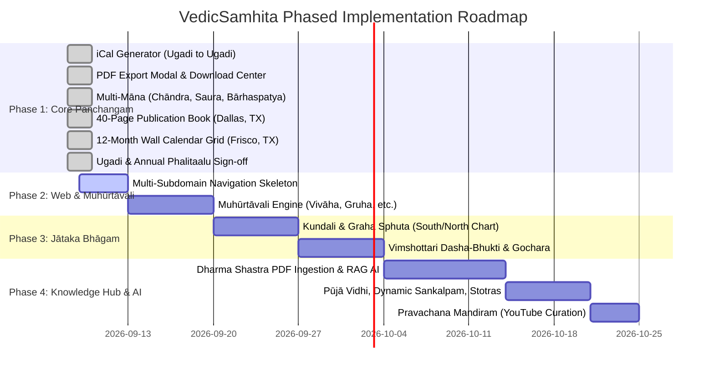

# VedicSamhita — Master Project Schedule & Roadmap

**Author & Guide:** Ramachandra sastry Munimadugu  
**Platform:** [www.vedicsamhita.com](https://www.vedicsamhita.com)  
**Last Updated:** September 2026

---

## 📅 Development Phases & Milestones

---

## 📌 Detailed Phase Breakdown

### Phase 1: Core Panchangam, iCal & Multi-Māna (Completed ✅)
> **Goal:** Complete and polish all astronomical outputs, export tools, and core calculations.

1. **iCal Generator Upgrade (`generate_ical.py` & client-side `panchangam-v18.js`) — [DONE ✅]**
   - **Date Span:** Strict Ugadi-to-Ugadi window.
   - **Title Format:** Exact classical format `{Year} {Month} {Paksha} {Tithi}` (e.g. `Parabhava Chaitra Shukla Prathama`, `Parabhava Chaitra Shukla Tritiya`). Strictly **no festival names** in titles.
   - **Event Body:** Sun & Moon times, Pancha Angas with exact Pada, Kala (Rahu, Yama, Gulika, Durmuhuratam, Varjyam, Amrita Kalam, Abhijit), and VedicSamhita credits.
   - **Status:** Verified and certified by author for Dallas, TX.

2. **Universal Download Center & Modal (`#downloadModal`) — [DONE ✅]**
   - Interactive gold & maroon modal embedded in `index.html`.
   - Automatic live binding to active base location (Frisco, Dallas, San Francisco, Hyderabad, or GPS coordinates).
   - One-click selection between Chāndramāna, Sauramāna, and Bārhaspatyamāna.
   - Separate direct download actions for 40-Page Publication Book, 12-Month Wall Grid, and iCal calendar.

3. **40-Page Classical Publication Book PDF — [DONE ✅]**
   - High-resolution watercolor Subrahmanya temple cover, dedication, Navanāyaka shlokas, Ādāya-Vyaya, Kandāya, Makara Sankrānti Purusha, and 8-column landscape tables.
   - Generated & verified: [`Panyam_Panchangam_Parabhava_Dallas.pdf`](file:///d:/OWN%20PANCHANGAM%20BUILD/Panyam%20AI%20Panchangam/generated_panchangams/USA/Panyam_Panchangam_Parabhava_Dallas.pdf) (8.68 MB).

4. **12-Month Wall Calendar Grid (Jan–Dec 2026) — [DONE ✅]**
   - Dedicated landscape 7-column wall-hanging grid layout (Sunday to Saturday, Sunday in crimson).
   - Each cell contains large Gregorian date, moon phase icons, sunrise/sunset, tithi with end times, nakshatra with pada, Rahu Kalam, and highlighted festival badges.
   - Generated & verified for Frisco, TX: [`VedicSamhita_Wall_Calendar_2026_Frisco.pdf`](file:///d:/OWN%20PANCHANGAM%20BUILD/Panyam%20AI%20Panchangam/generated_panchangams/USA/VedicSamhita_Wall_Calendar_2026_Frisco.pdf) (6.47 MB, 13 pages with Cover).

5. **Multi-Māna Engine Integration — [DONE ✅]**
   - **Chāndramāna (చాంద్రమానం):** Amānta & Pūrṇimānta tithi/month algorithms.
   - **Sauramāna (సౌరమానం):** Exact Nirayana Sun ingress (Sankrānti) timestamps and solar month day counts.
   - **Bārhaspatyamāna (బార్హస్పత్యమానం):** Jupiter sign ingress, 60-year Jovian samvatsara cycles, and 12-year Pushkara river timings.

6. **Ugadi Phalitaalu Final Certification — [DONE ✅]**
   - Cross-checked Navanāyaka shlokas, Makara Sankrānti Purusha Lakshaṇam, and Ādāya-Vyayam tables.

---

### Phase 2: Platform Architecture & Muhūrtāvali (Next Milestone)
> **Goal:** Launch the classical electional astrology engine (**ముహూర్త భాగము**) and deliver it across **Publication PDFs, iCal subscriptions, and the interactive Web App**.

1. **Multi-Subdomain Ecosystem Setup**
   - `panchangam.vedicsamhita.com` (Core Calendar & Daily Lagnas)
   - `muhurta.vedicsamhita.com` (Muhūrtāvali Engine)
   - `jataka.vedicsamhita.com` (Jātaka Bhāgam)
   - Persistent top navigation bar + synchronized user location (e.g., Frisco / Dallas / San Francisco / Hyderabad) across all subdomains.

2. **5-Layer Muhūrtāvali Computation Engine (`panchangam_engine/muhurta.py`)**
   - Built on classical treatises: *Muhūrta Chintāmaṇi*, *Kālamādhavīyam*, *Muhūrta Dīpikā*, and *Dharma Sindhu*.
   - **Layer 1 (Māsa & Moudhyam):** Guru/Shukra Moudhyam (Combustion), Bāla/Vṛddha Dosha, Shūnya Māsas (Dhanur/Mīna), Hari Shayana (Chāturmāsya), Adhika/Kshaya Māsas.
   - **Layer 2 (5-Anga Dina Shuddhi):** Rikta Tithi rejection (4, 9, 14, 30), Vāsara filtering, Nakshatra compatibility, 8 malefic Yoga rejection, Vishti (Bhadra) & fixed Karaṇa rejection.
   - **Layer 3 (21 Mahā Doshas):** Nakshatra Varjyam (poisonous 4 ghatis), Agni/Kartharī Dosha, Grahaṇa (Eclipse) 3-day windows, Sankrānti 16-ghati exclusion, Tithi/Nakshatra/Lagna Gaṇḍāntam.
   - **Layer 4 (Lagna Shuddhi — "లగ్నం కోటి గుణాన్వితం"):** 
     - **Aṣṭama Shuddhi (అష్టమ శుద్ధి):** Mandatory 8th house emptiness from Muhūrta Lagna.
     - **Saptama Shuddhi (సప్తమ శుద్ధి):** Mandatory 7th house emptiness for Vivāham.
     - **Sthira Lagna:** Fixed sign enforcement (Vrishabha, Simha, Vrischika, Kumbha) for Gruhapravēśam.
     - **Pushkarāmsha (పుష్కరాంశ):** Identification of 100,000-dosha neutralizing sub-arc windows.
   - **Layer 5 (Individual Compatibility):** Automated Tārābalam (1-9 mod 9), Chandrabalam (excluding 6, 8, 12 from Janma Rashi), and Gurubalam (2, 5, 7, 9, 11 for bride).

3. **Ṣhoḍaśa / Panchadaśa Samskāras Covered**
   - 💍 **Vivāham (వివాహం):** Strict Saptama & Ashtama Shuddhi, Kuja Dosha exclusion, Jamitra Dosha filter.
   - 🏡 **Gruhapravēśam (గృహప్రవేశం):** Sthira Lagnas, Agni Karthari exclusion, 4th/8th house shuddhi (New House vs. Renovation).
   - 🪢 **Upanayanam (ఉపనయనం):** Uttarayana, Guru/Shukra strength, Tri-Bala Shuddhi.
   - 👶 **Nāmakaraṇam & Annaprāśana (నామకరణం, అన్నప్రాశన):** 10th/12th day, 6th month, benefic Lagnas.
   - 🚗 **Vāhana Kraya (వాహన కొనుగోలు):** Chara/Dvisvabhava Lagnas, Venus & Mars strength.
   - 🏗️ **Śaṅku Sthāpana & Bhūmi Pūjā (శంకుస్థాపన, భూమి పూజ):** Vastu purusha sleeping cycles, Sthira lagnas.
   - 🛍️ **Vyāpāra Ārambha (వ్యాపార ప్రారంభం):** Labha sthana (11th house) strength, Mercury/Jupiter placement.
   - ✈️ **Yātrā (ప్రయాణం / యాత్ర):** Dishā Shūla avoidance, Yogini consideration, Sukha Lagnas.
   - ✍️ **Akṣarābhyāsam & Karṇa Vēdha (అక్షరాభ్యాసం, కర్ణవేధ):** Saraswati/Budha Lagnas, Shukla Paksha.

4. **Multi-Channel Delivery System (Cross-Platform Integration)**
   - 📄 **Publication PDF (Annual Book & Wall Grid):** Dedicated "ముహూర్త భాగము (Annual Certified Muhūrta Section)" landscape pages detailing Date, Day, Tithi, Nakshatra, Exact Lagna Window, Pushkarāmsha, Shuddhi notes, and Anukūla Nakshatras.
   - 📅 **iCal (.ics) Calendar Feed:** Specialized iCal feed allowing users to subscribe directly to certified Vivāha, Gruhapravēśa, and Upanayana Muhūrtams with exact time-blocked alert notifications on Google Calendar, Apple Calendar, and Outlook.
   - 💻 **Website & Web App (`index.html`):** Interactive Muhūrtam Explorer with instant location recalculation, category dropdowns, and personal birth-star (Janma Nakshatra/Rashi) Tārābalam compatibility checker.

---

### Phase 3: Jātaka Bhāgam (Horoscope Engine)
> **Goal:** Comprehensive astrological calculations for individuals.

1. **Kundali & Planetary Sphuta Engine**
   - High-precision planetary longitudes (Sun through Ketu + Outer planets) using Swiss Ephemeris.
   - Chart styles: South Indian (Chakram), North Indian (Diamond), East Indian.
   - Divisional charts: D1 (Rashi), D9 (Navamsha), D10 (Dashamsha), etc.

2. **Dasha-Bhukti & Transits (Gochara)**
   - Exact Vimshottari Dasha system down to Pratyantar Dasha.
   - Daily Gochara analysis with Ashtakavarga scoring and Sade Sati / Kantaka Shani trackers.

---

### Phase 4: Sanātana Knowledge Hub & Dharma Shastra AI
> **Goal:** Complete all-in-one Sanātana portal and AI Q&A engine.

1. **Dharma Shastra Knowledge Base & RAG AI Engine**
   - Ingestion of classical texts: *Dharma Sindhu*, *Nirnaya Sindhu*, *Smriti Kaustubham*, *Smriti Muktaphalam*, *Vaidyanatha Dikshiteeyam*.
   - Native Sanskrit and Telugu OCR / text analysis.
   - AI assistant capable of answering user doubts citing the exact Adhāra Shloka, context, and resolution of disputed dates.

2. **Pūjā & Vrata Vidhi with Dynamic Sankalpam Generator**
   - Step-by-step procedures, required samagri, and stotras for major festivals.
   - **Dynamic Live Sankalpam:** Automatically builds the exact classical Sanskrit Sankalpam string based on the user’s live date, location, Ayana, Ritu, Masa, Paksha, Tithi, Vasara, and Nakshatra.

3. **Pravachana Mandiram & Digital Granthālayam**
   - Categorized YouTube lectures and audio discourses by traditional scholars.
   - Searchable digital library of Vedas, Upanishads, and 18 Puranas.

---

## 🚀 Immediate Next Action Items
1. Upgrade the **iCal Export module** (`panchangam.js` / Python engine) to implement the Ugadi-to-Ugadi date window and `{Māsam} {Paksham} {Tithi}` title format.
2. Build the **PDF Export Checkbox dialog** (Detailed Daily Book vs. Monthly Grid, Ugadi vs. Jan-Dec).
